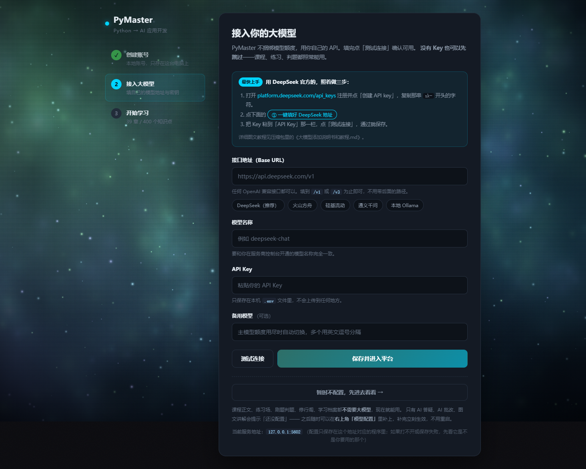
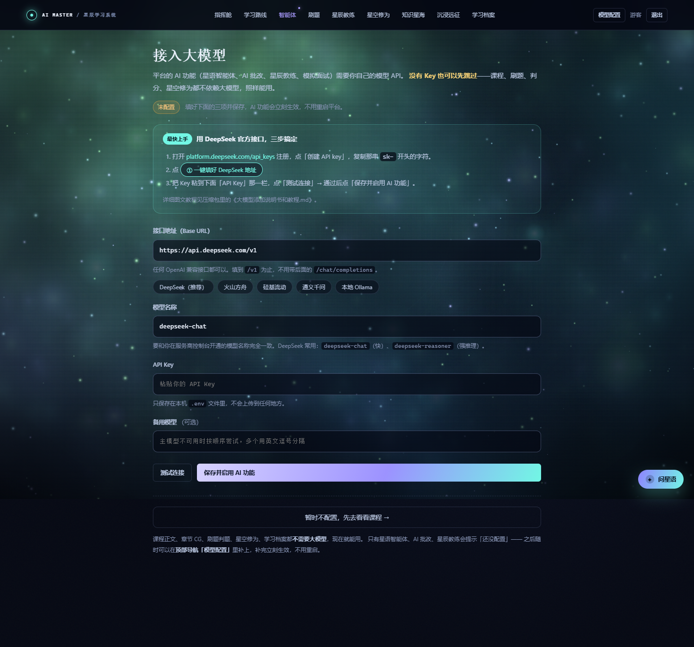

# 大模型添加说明书和教程

> 这份文档同时适用于 **PyMaster 教学平台** 和 **AI Master 星辰学习系统**。
> 两个平台的配置方法一模一样，只是网页地址不同：
>
> | 平台 | 本地地址 | 配置页 |
> | --- | --- | --- |
> | PyMaster | http://127.0.0.1:5000 | http://127.0.0.1:5000/setup |
> | AI Master | http://127.0.0.1:5178 | http://127.0.0.1:5178/setup |

---

## 目录

1. [先说最重要的一件事](#一先说最重要的一件事)
2. [不配置模型也能用吗？](#二不配置模型也能用吗)
3. [五分钟配置教程（DeepSeek 官方，推荐）](#三五分钟配置教程deepseek-官方推荐)
4. [常见问题排查](#四常见问题排查)
5. [换个服务商怎么填](#五换个服务商怎么填)
6. [用本机跑的模型（Ollama）](#六用本机跑的模型ollama)
7. [安全与其他说明](#七安全与其他说明)

---

## 一、先说最重要的一件事

**平台不捆绑、也不代购模型额度，用的是你自己的 API Key。**

这样做的原因：

- 你可以自由选服务商（DeepSeek、火山方舟、硅基流动、通义千问、本地 Ollama……）；
- 你的对话内容只从你的电脑发到你自己选的服务商，不经过任何中间服务器；
- 额度、账单、限速都清清楚楚在你自己的账号里。

新账号一般有免费额度，够把这门课从头学到尾。

---

## 二、不配置模型也能用吗？

**能。** 而且这不是"凑合能用"，是完整可用。

平台在设计上把功能分成了两类：

| 功能 | 需要大模型吗 | 不配置时 |
| --- | --- | --- |
| 课程正文、章节讲解、教材插图 | ❌ 不需要 | ✅ 全部正常 |
| 章节 CG 动画、3D 星海、星际跃迁 | ❌ 不需要 | ✅ 全部正常 |
| 练习场：写代码、运行、看结果 | ❌ 不需要 | ✅ 全部正常 |
| 刷题中心：选择题 / 简答题 / 代码题 | ❌ 不需要 | ✅ 全部正常 |
| 判题与得分、错题本、解析 | ❌ 不需要 | ✅ 全部正常（断言式判题在本地跑） |
| 学习进度、修行阁 / 星空修为、学习档案 | ❌ 不需要 | ✅ 全部正常 |
| AI 答疑（星语 / JJ 老师） | ✅ 需要 | 提示"还没配置大模型" |
| AI 批改简答题与代码题 | ✅ 需要 | 自动降级为本地判题，仍给分 |
| 星辰教练、模拟面试、语音问答 | ✅ 需要 | 提示"还没配置大模型" |
| 五分钟图文讲解生成 | ✅ 需要 | 提示"还没配置大模型" |

所以**没有 Key 也可以先跳过**：首次打开时点那一行

> 暂时不配置，先去看看课程 →

就能直接进入平台。之后随时点顶部的 **「模型配置」** 补上即可，**补完立刻生效，不用重启**。

> 平台右下角会挂一个小小的提示条提醒你"AI 功能未开启"。
> 点它就能跳到配置页；关掉它只对当前这个标签页有效，刷新页面还会出现 ——
> 免得你忘记这件事，也免得它一直挡着你看不清。

---

## 三、五分钟配置教程（DeepSeek 官方，推荐）

### 第 1 步：申请一个 API Key

1. 打开 <https://platform.deepseek.com/api_keys>

   > 需要先注册并完成实名认证（国内平台都要求）。

2. 登录后，在左侧找到 **「API keys」**，点右侧的 **「创建 API key」** 按钮。

3. 给这个 key 起个名字（随便写，比如 `学习平台`），点确认。

4. 复制弹出的那一串字符。它长这样：

   ```
   sk-这里是你的密钥粘贴进来就行
   ```

   > ⚠️ **这串字符只显示这一次。** 关掉弹窗就再也看不到了，
   > 请立刻粘贴到记事本里存着（或者直接粘到下一步的输入框里）。
   > 真丢了也不怕 —— 重新创建一个就行，旧的删掉即可。

5. 顺手看一眼 **「账户余额」**：新账号有赠送额度，
   如果显示 0 元，充个几块十几块就足够把这门课学完。

### 第 2 步：打开平台的配置页

启动平台后，浏览器会自动打开首页。配置页有两种进入方式：

- **第一次打开**：平台会直接把你带到配置页；
- **之后想改**：点顶部导航栏的 **「模型配置」**（PyMaster 在右上角账号附近，AI Master 在右上角）。

配置页长这样（下图为 AI Master，PyMaster 是同一个表单）：

**PyMaster 的配置页：**



**AI Master 的配置页：**



### 第 3 步：填三个空

| 字段 | 填什么 |
| --- | --- |
| **接口地址（Base URL）** | `https://api.deepseek.com/v1` |
| **模型名称** | `deepseek-chat` |
| **API Key** | 粘贴第 1 步复制的那串 `sk-` 开头的字符 |

**不用手打**：配置页上有一个 **「DeepSeek（推荐）」** 按钮，
点一下就把地址和模型名都填好了，你只需要粘 Key。

如果你点了快速上手区的 **「① 一键填好 DeepSeek 地址」**，效果完全一样。

### 第 4 步：点「测试连接」

这一步会真的向 DeepSeek 发一条最小请求，确认"地址对、Key 对、额度够"。

- ✅ 成功会显示：`✓ 调用成功，模型回复：可用`
- ❌ 失败会明确告诉你原因，比如：
  - `API Key 不正确或已失效` → Key 复制少了字符，或者创建后还没生效（等 1 分钟）
  - `请求过于频繁，或额度已用尽` → 去控制台看余额，或等一会儿再试
  - `模型名称或接口地址不对` → 检查**模型名称**那一栏是不是写成了 `deepseek-chat`（注意中间是短横线）
  - `连不上这个接口` → 网络问题，或公司/校园网拦截了该域名

> 测试连接**不会**消耗什么额度，也不会把配置存下来 ——
> 它只是"试探一下能不能通"。放心多点几次。

### 第 5 步：保存

点 **「保存并进入平台」**（AI Master 上是「保存并启用 AI 功能」）。

成功后会跳到首页，**AI 功能立刻可用**，不需要关闭再重启平台。

> 配置保存在平台目录下的 `.env` 文件里，只在你自己的电脑上。
> 这个文件不会被上传到任何地方，也不会进 Git 仓库。

### 第 6 步：验证一下

随便找个地方试试 AI 功能：

- **PyMaster**：打开任意章节，点右侧的「问 JJ 老师」；或者进「星辰教练」发一句话。
- **AI Master**：点顶部「智能体」，问一句"什么是 RAG"；或者在「星辰教练」里发一句话。

能看到字一个个往外蹦就说明配置成功了。

---

## 四、常见问题排查

### 问题 1：测试连接失败，提示 Key 不对

1. 确认复制完整 —— Key 一般 30–50 个字符，以 `sk-` 开头；
2. 确认没有多余的空格（从网页复制时常会带一个尾随空格，粘贴后检查一下）；
3. 确认服务商控制台里这个 Key 是**启用**状态，且**余额大于 0**；
4. 新建的 Key 偶尔要等 1–2 分钟才生效，等一会儿再点测试。

### 问题 2：测试连接成功，但用的时候报错

| 现象 | 原因 | 处理 |
| --- | --- | --- |
| 用了一会儿开始报"额度已用尽" | 免费额度或余额花完了 | 去服务商控制台充值，或换一个模型 |
| 偶发"连接超时" | 服务商偶尔不响应（实测 6 次里可能有 1 次） | 平台会自动重试 3 次，重试后基本都能成；连续失败就稍等再试 |
| 第一次回答要等 5–8 秒 | 这是推理模型的"思考"过程 | 平台默认已关掉思考；若仍慢，换成 `deepseek-chat` 而不是 `deepseek-reasoner` |
| 提示"模型没有返回正文" | 推理型模型把 token 用在了思考上 | 点重试即可；或换 `deepseek-chat` |

### 问题 3：想换一个模型

打开配置页，直接把「模型名称」改掉，点「测试连接」→「保存」即可。
**API Key 那一栏留空就行**，表示"沿用已保存的那把"，不用重新粘贴。

### 问题 4：想彻底清空配置

打开平台目录下的 `.env` 文件（记事本即可），把 `ARK_API_KEY=` 后面清空，
保存后重启平台。平台会回到"未配置"状态，再点一次跳过就还是完整可用。

### 问题 5：能不能多个人共用一把 Key？

技术上可以（同一个 Key 配在每台电脑上），但**不建议**：

- 额度会一起消耗，一个人刷完了别人就用不了；
- 服务商可能因"多地并发"触发限流；
- 学生的对话内容会混在同一个账号的用量统计里。

如果是要给一个班用，正确做法是**部署到服务器上**，
让每个人都注册自己的账号（学习进度分开存），
但模型 Key 由管理员统一配一把 —— 这样既省事又不会互相影响。
具体见《本地与云服务器部署教程.md》。

---

## 五、换个服务商怎么填

配置页上已经内置了常用服务商的**一键填充按钮**，点一下就好。
如果用的是没列出来的服务商，照下面的表填：

| 服务商 | 接口地址（Base URL） | 模型名称示例 |
| --- | --- | --- |
| **DeepSeek（推荐）** | `https://api.deepseek.com/v1` | `deepseek-chat` / `deepseek-reasoner` |
| 火山方舟（豆包） | `https://ark.cn-beijing.volces.com/api/v3` | 你的**推理接入点 ID**（不是模型名） |
| 硅基流动 | `https://api.siliconflow.cn/v1` | `deepseek-ai/DeepSeek-V3` |
| 通义千问 | `https://dashscope.aliyuncs.com/compatible-mode/v1` | `qwen-plus` |
| 智谱 GLM | `https://open.bigmodel.cn/api/paas/v4` | `glm-4-plus` |
| Moonshot | `https://api.moonshot.cn/v1` | `moonshot-v1-8k` |
| 本地 Ollama | `http://localhost:11434/v1` | `qwen2.5:7b` |

**关键点：接口地址填到 `/v1` 或 `/v3` 为止**，不要带后面的
`/chat/completions` —— 平台会自己补上。

> 火山方舟要注意：它要求填**推理接入点 ID**（形如 `ep-2024xxxx-xxxxx`），
> 不是 `doubao-xxx` 这种模型名。在火山控制台创建接入点后复制那个 ID。

---

## 六、用本机跑的模型（Ollama）

如果你机器性能够、也想完全不联网，可以用 Ollama：

1. 装 Ollama：<https://ollama.com/download>
2. 命令行拉一个模型：
   ```bash
   ollama pull qwen2.5:7b
   ```
3. 在配置页填：
   - 接口地址：`http://localhost:11434/v1`
   - 模型名称：`qwen2.5:7b`
   - API Key：随便填（比如 `ollama`）—— 本地不需要鉴权，但这一栏不能空

> 7B 级别的本地模型做**答疑和讲解**够用，但做**代码批改**时不如云端大模型准。
> 建议作为备用，主用还是云端。

---

## 七、安全与其他说明

### Key 存在哪？

存在平台目录下的 `.env` 文件里，纯文本，权限跟随你的系统账号。
它**不会**：

- 上传到任何服务器；
- 写进日志（平台的日志只记事件类型，不记 Key）；
- 被打进分发包（打包脚本会主动校验并拒绝包含 `.env` 的包）。

### 分享给朋友时要注意

如果你把平台目录整个拷给别人（包括 `.env`），**Key 也就一起给出去了** ——
对方可以用你的额度。正确做法是：给纯净的压缩包，让对方自己配 Key。

### 对话内容会去哪里？

只从你的电脑发到你配置的那个服务商（比如 DeepSeek 官方）。
平台本身没有任何中转、统计或回传。服务商怎么处理这些数据，
取决于他们的隐私政策 —— 这是选服务商时要考虑的一点。

### 平台的"测试连接"到底发了什么？

只有一条极短的请求：

```
请只回复两个字：可用
```

不包含你的任何学习数据、账号信息或本地文件。

---

## 附：配置检查清单

配完后对照一遍：

- [ ] 能打开平台首页（`http://127.0.0.1:5000` 或 `http://127.0.0.1:5178`）
- [ ] 顶部的「模型配置」能点开
- [ ] 「测试连接」返回的是 ✓ 而不是 ✗
- [ ] 保存后能看到"配置已保存并生效"
- [ ] 网页右下角**不再**显示"AI 功能未开启"的提示条
- [ ] 随便问一句 AI，能看到回答

全部打勾就完成了。祝学习顺利 🎉
